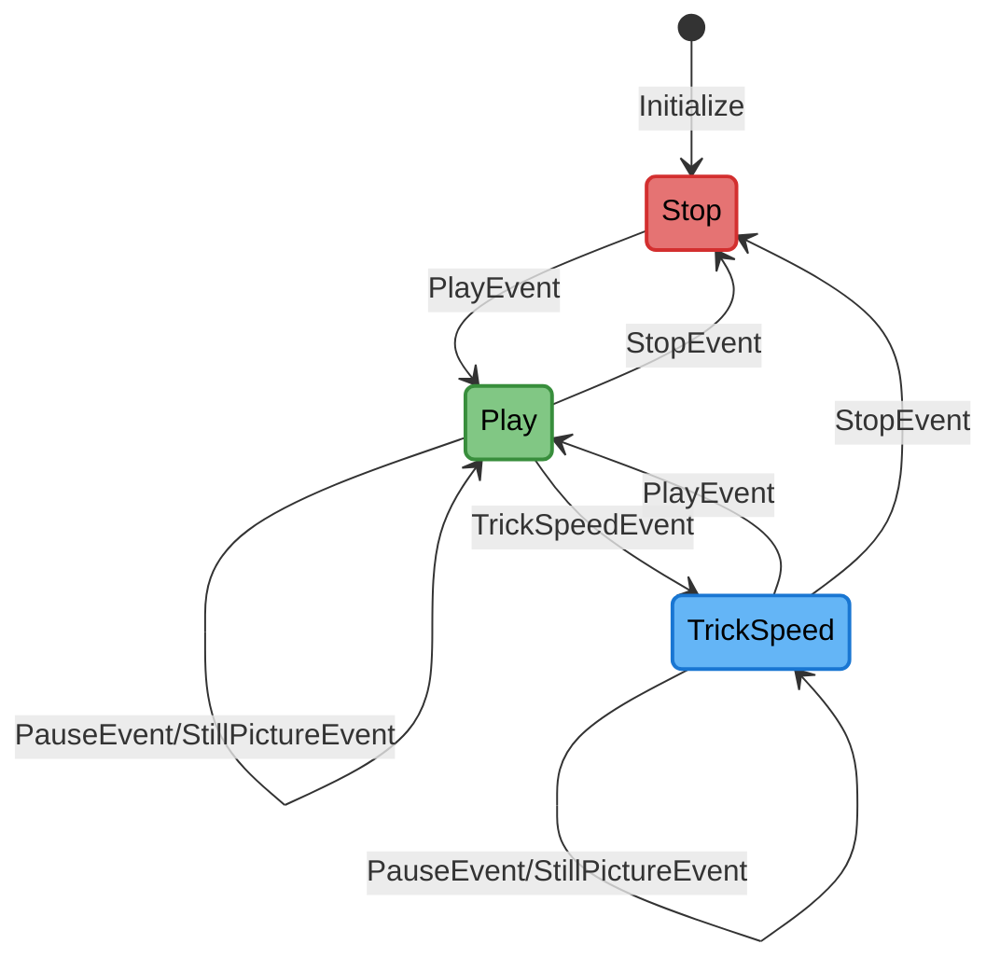
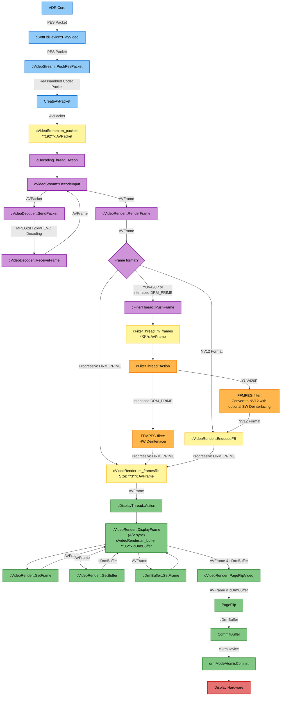

# Developer Documentation - softhddevice-drm-gles

This document contains technical documentation for developers, including the playback state machine and video data flow.

## Playmode Graph

This graph is a representation, how VDR changes the playmode and which commands are called in the device. It is the base graph for the following state diagrams. Simply walk through the graph from top to bottom. Every box start with the VDR command (Play(), Pause(), Forward(), Backward()) and includes the current playmodes the command is executed on.

```mermaid
graph TD
%% Playmodes

    Player --> ToPlayPlay["**Play():**<br>pmPause<br>pmPlay<br>pmSlow(forward)"]
    Player --> ToPlayPause["**Pause():**<br>pmStill<br>pmPause"]
    ToPlayPlay --------> DevicePlay["DevicePlay()"]
    ToPlayPause --------> DevicePlay["DevicePlay()"]

    Player--> ToFreezeForward["**Forward():**<br>pmSlow(forward)"]
    ToFreezeForward --------> DeviceFreeze["DeviceFreeze()"]

    Player--> ToMuteForward["**Forward():**<br>pmStill<br>pmPause"]
    ToMuteForward ------> DeviceMute["DeviceMute()"]

    Player --> ToClearPlay["**Play():**<br>pmStill<br>pmFast(forward)<br>pmFast(backward)<br>pmSlow(backward)"]
    Player --> ToClearPause["**Pause():**<br>pmFast(forward)<br>pmFast(backward)<br>pmSlow(backward)"]
    Player--> ToClearForward["**Forward():**<br>pmPlay<br>pmFast(forward)<br>pmFast(backward)<br>pmSlow(backward)"]
    Player --> ToClearBackward["**Backward():**<br>pmPlay<br>pmFast(forward)<br>pmFast(backward)<br>pmSlowforward<br>pmSlow(backward)"]
    Player --> ToMuteBackward["**Backward():**<br>pmStill<br>pmPause"]

    Player --> ToClearStillPicture["**Goto():**<br>Mark editing<br>(pause after edit)"]
    ToClearStillPicture ---> DeviceClear["DeviceClear()"]
    DeviceClear ---> ClearToStillPicture["**Goto():**<br>Mark editing<br>(pause after edit)"]
    ClearToStillPicture ----> DeviceStillPicture["DeviceStillPicture()"]

    Player --> ToClearStillPicture2["**Goto():**<br>Mark editing<br>(play after edit)"]
    ToClearStillPicture2 ---> DeviceClear["DeviceClear()"]
    DeviceClear ---> ClearToPlayStillPicture["**Goto():**<br>Mark editing<br>(play after edit)"]
    ClearToPlayStillPicture ----> DevicePlay["DevicePlay()"]

    Player --> ToClearSkip["**SkipSeconds():**<br>Yellow/Green jumping"]
    ToClearSkip ---> DeviceClear["DeviceClear()"]
    DeviceClear ---> ClearToPlaySkip["**SkipSeconds():**<br>Yellow/Green jumping"]
    ClearToPlaySkip ----> DevicePlay["DevicePlay()"]

    ToClearPlay ---> DeviceClear["DeviceClear()"]
    ToClearPause ---> DeviceClear["DeviceClear()"]
    ToClearForward ---> DeviceClear["DeviceClear()"]
    ToClearBackward ---> DeviceClear["DeviceClear()"]
    ToMuteBackward ------> DeviceMute["DeviceMute()"]

    Player --> ToFreeze["**Pause():**<br>pmPlay<br>pmSlow(forward)"]
    ToFreeze --------> DeviceFreeze["DeviceFreeze()"]

    DeviceClear ---> ClearToPlayPlay["**Play():**<br>pmStill<br>pmFast(forward)<br>pmFast(backward)<br>pmSlow(backward)"]
    DeviceClear ---> ClearToPlayBackward["**Backward():**<br>pmFast(backward)"]
    DeviceClear ---> ClearToPlayForward["**Forward():**<br>pmFast(forward)"]
    ClearToPlayPlay ----> DevicePlay["DevicePlay()"]
    ClearToPlayForward ----> DevicePlay["DevicePlay()"]
    ClearToPlayBackward ----> DevicePlay["DevicePlay()"]

    DeviceClear ---> ClearToMuteForward["**Forward():**<br>pmPlay<br>pmFast(backward)<br>pmSlow(backward)"]
    DeviceClear ---> ClearToMuteBackward["**Backward():**<br>pmPlay<br>pmFast(forward)<br>pmSlow(forward)"]
    ClearToMuteForward --> DeviceMute["DeviceMute()"]
    ClearToMuteBackward --> DeviceMute["DeviceMute()"]

    DeviceMute --> ToTrickSpeedForward["**Forward():**<br>pmStill<br>pmPause<br>pmPlay<br>pmFast(backward)<br>pmSlow(backward)"]
    DeviceMute --> ToTrickSpeedBackward["**Backward():**<br>pmStill<br>pmPause<br>pmPlay<br>pmFast(forward)<br>pmSlow(forward)"]
    ToTrickSpeedForward --> DeviceTrickSpeed["DeviceTrickSpeed"]
    ToTrickSpeedBackward --> DeviceTrickSpeed["DeviceTrickSpeed"]

    DeviceClear ---> ClearToFreezePause["**Pause():**<br>pmFast(forward)<br>pmFast(backward)<br>pmSlow(backward)"]
    DeviceClear ---> ClearToFreezeBackward["**Backward():**<br>pmSlow(backward)"]
    ClearToFreezePause ----> DeviceFreeze["DeviceFreeze()"]
    ClearToFreezeBackward ----> DeviceFreeze["DeviceFreeze()"]

    DevicePlay --> pmPlay["pmPlay"]
    DeviceFreeze --> pmPause["pmPause"]
    DeviceStillPicture --> pmStill["pmStill"]
    DeviceTrickSpeed --> pmTrick["pmFast(forward)<br>pmFast(backward)<br>pmSlow(forward)<br>pmSlow(backward)"]

    %% Styling
    classDef player fill:#90caf9,stroke:#1976d2,stroke-width:2px,color:#000000
    classDef endpoint fill:#e57373,stroke:#d32f2f,stroke-width:3px,color:#000000
    classDef commands fill:#81c784,stroke:#388e3c,stroke-width:2px,color:#000000

    class Player, player
    class DeviceClear,DeviceMute, commands
    class DevicePlay,DeviceFreeze,DeviceTrickSpeed,DeviceStillPicture endpoint
```

## State Diagram

This is the model of the state machine implemented in softhddevice.cpp.

## Video Data Flow Call Graph

This section shows the complete data flow of video frames from VDR through the plugin to the display hardware.

## Overview

The video pipeline consists of 4 main threads:

1. 🔵**VDR Thread** - Receives video data from VDR
2. 🟣**cDecodingThread** - Decodes video packets using FFmpeg
3. 🟠**cFilterThread** - Applies filters (deinterlacing, scaling)
4. 🟢**cDisplayThread** - Syncs with audio and commits frames to DRM/KMS

- 🔴 Hardware (DRM/KMS display hardware)
- 🟡 Buffers (frame buffers and queues)

## Detailed Call Graph

## VDR State Management

When managing the VDR states (play/pause/trick speed/...), the following paradigms are follow:

- On every call of above VDR methods, we wait at a single and central location, that the display and decoding threads finish their currently processing packet/frame. Then, the threads are locked (halted), and the necessary changes are done in a thread-safe and predictable way, until they resume their normal work.
- What should happen in which state is also handled in a single and central location. Therefore, VDR's state is tracked in a variable. When one of PlayMode()/Freeze()/Clear()/... are invoked (I call it "events"), they are handled according to in which state VDR is currently in (play/stop/trickspeed). So, you can clearly see in the code, what happens in a particular state, when a specific event is received. The state transitions are handled in cSoftHdDevice::OnEventReceived() and what shall be done when entering or leaving a state is done in cSoftHdDevice::OnEnteringState()/cSoftHdDevice::OnLeavingState().

This was introduced in PR #91.
