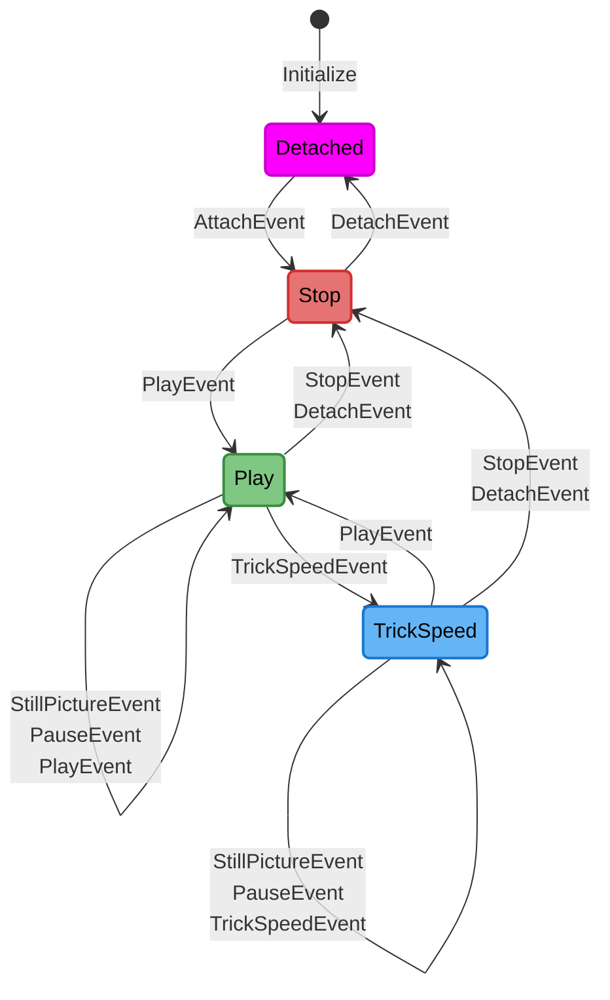
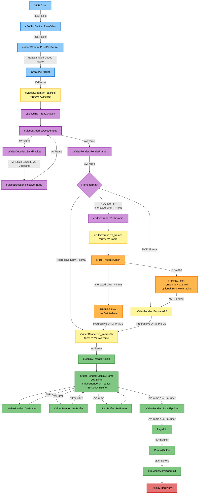
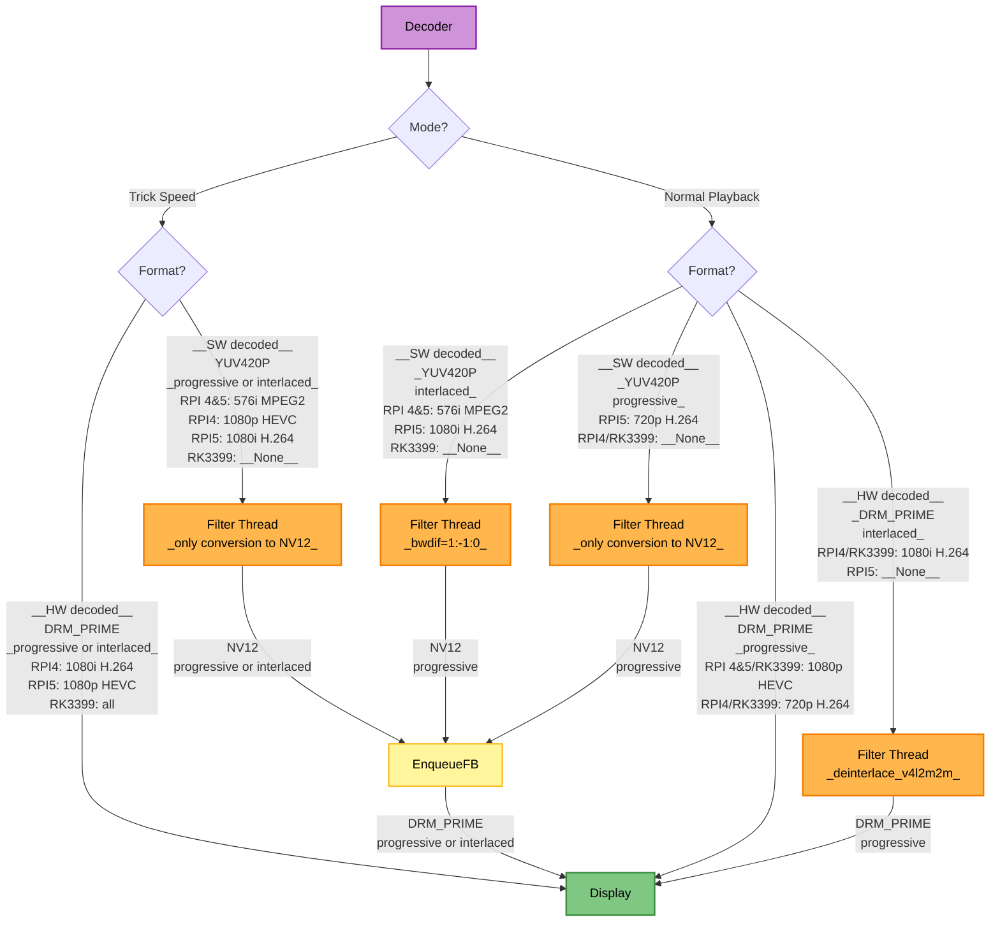
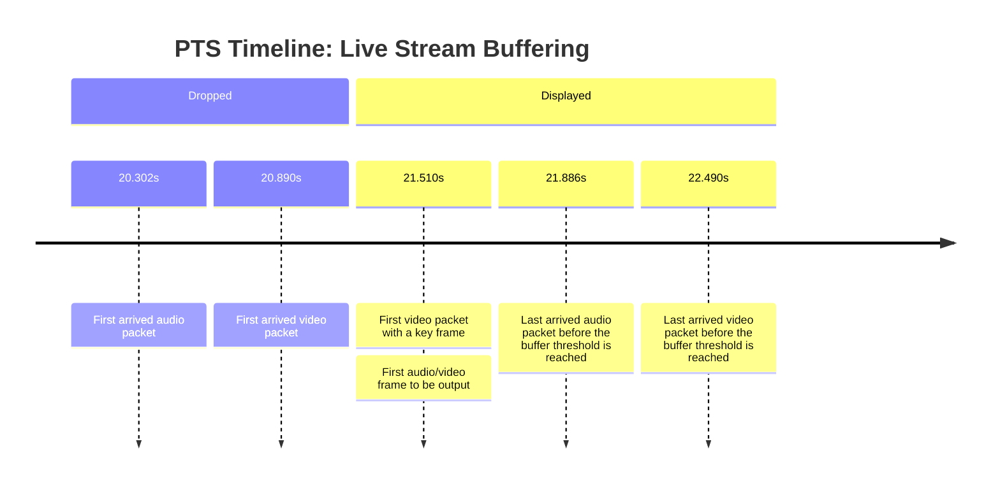

# Developer Documentation - softhddevice-drm-gles

This document contains technical documentation for developers.

## Playmode Graph

This graph is a representation, how VDR changes the playmode and which commands are called in the device. It is the base graph for the following state diagrams. Simply walk through the graph from top to bottom. Every box start with the VDR command (Play(), Pause(), Forward(), Backward()) and includes the current playmodes the command is executed on.

```mermaid
graph TD
%% Playmodes

    Player --> ToPlayPlay["**Play():**<br>pmPause<br>pmPlay<br>pmSlow(forward)"]
    Player --> ToPlayPause["**Pause():**<br>pmStill<br>pmPause"]
    ToPlayPlay --------> DevicePlay["DevicePlay()"]
    ToPlayPause --------> DevicePlay["DevicePlay()"]

    Player--> ToFreezeForward["**Forward():**<br>pmSlow(forward)"]
    ToFreezeForward --------> DeviceFreeze["DeviceFreeze()"]

    Player--> ToMuteForward["**Forward():**<br>pmStill<br>pmPause"]
    ToMuteForward ------> DeviceMute["DeviceMute()"]

    Player --> ToClearPlay["**Play():**<br>pmStill<br>pmFast(forward)<br>pmFast(backward)<br>pmSlow(backward)"]
    Player --> ToClearPause["**Pause():**<br>pmFast(forward)<br>pmFast(backward)<br>pmSlow(backward)"]
    Player--> ToClearForward["**Forward():**<br>pmPlay<br>pmFast(forward)<br>pmFast(backward)<br>pmSlow(backward)"]
    Player --> ToClearBackward["**Backward():**<br>pmPlay<br>pmFast(forward)<br>pmFast(backward)<br>pmSlowforward<br>pmSlow(backward)"]
    Player --> ToMuteBackward["**Backward():**<br>pmStill<br>pmPause"]

    Player --> ToClearStillPicture["**Goto():**<br>Mark editing<br>(pause after edit)"]
    ToClearStillPicture ---> DeviceClear["DeviceClear()"]
    DeviceClear ---> ClearToStillPicture["**Goto():**<br>Mark editing<br>(pause after edit)"]
    ClearToStillPicture ----> DeviceStillPicture["DeviceStillPicture()"]

    Player --> ToClearStillPicture2["**Goto():**<br>Mark editing<br>(play after edit)"]
    ToClearStillPicture2 ---> DeviceClear["DeviceClear()"]
    DeviceClear ---> ClearToPlayStillPicture["**Goto():**<br>Mark editing<br>(play after edit)"]
    ClearToPlayStillPicture ----> DevicePlay["DevicePlay()"]

    Player --> ToClearSkip["**SkipSeconds():**<br>Yellow/Green jumping"]
    ToClearSkip ---> DeviceClear["DeviceClear()"]
    DeviceClear ---> ClearToPlaySkip["**SkipSeconds():**<br>Yellow/Green jumping"]
    ClearToPlaySkip ----> DevicePlay["DevicePlay()"]

    ToClearPlay ---> DeviceClear["DeviceClear()"]
    ToClearPause ---> DeviceClear["DeviceClear()"]
    ToClearForward ---> DeviceClear["DeviceClear()"]
    ToClearBackward ---> DeviceClear["DeviceClear()"]
    ToMuteBackward ------> DeviceMute["DeviceMute()"]

    Player --> ToFreeze["**Pause():**<br>pmPlay<br>pmSlow(forward)"]
    ToFreeze --------> DeviceFreeze["DeviceFreeze()"]

    DeviceClear ---> ClearToPlayPlay["**Play():**<br>pmStill<br>pmFast(forward)<br>pmFast(backward)<br>pmSlow(backward)"]
    DeviceClear ---> ClearToPlayBackward["**Backward():**<br>pmFast(backward)"]
    DeviceClear ---> ClearToPlayForward["**Forward():**<br>pmFast(forward)"]
    ClearToPlayPlay ----> DevicePlay["DevicePlay()"]
    ClearToPlayForward ----> DevicePlay["DevicePlay()"]
    ClearToPlayBackward ----> DevicePlay["DevicePlay()"]

    DeviceClear ---> ClearToMuteForward["**Forward():**<br>pmPlay<br>pmFast(backward)<br>pmSlow(backward)"]
    DeviceClear ---> ClearToMuteBackward["**Backward():**<br>pmPlay<br>pmFast(forward)<br>pmSlow(forward)"]
    ClearToMuteForward --> DeviceMute["DeviceMute()"]
    ClearToMuteBackward --> DeviceMute["DeviceMute()"]

    DeviceMute --> ToTrickSpeedForward["**Forward():**<br>pmStill<br>pmPause<br>pmPlay<br>pmFast(backward)<br>pmSlow(backward)"]
    DeviceMute --> ToTrickSpeedBackward["**Backward():**<br>pmStill<br>pmPause<br>pmPlay<br>pmFast(forward)<br>pmSlow(forward)"]
    ToTrickSpeedForward --> DeviceTrickSpeed["DeviceTrickSpeed"]
    ToTrickSpeedBackward --> DeviceTrickSpeed["DeviceTrickSpeed"]

    DeviceClear ---> ClearToFreezePause["**Pause():**<br>pmFast(forward)<br>pmFast(backward)<br>pmSlow(backward)"]
    DeviceClear ---> ClearToFreezeBackward["**Backward():**<br>pmSlow(backward)"]
    ClearToFreezePause ----> DeviceFreeze["DeviceFreeze()"]
    ClearToFreezeBackward ----> DeviceFreeze["DeviceFreeze()"]

    DevicePlay --> pmPlay["pmPlay"]
    DeviceFreeze --> pmPause["pmPause"]
    DeviceStillPicture --> pmStill["pmStill"]
    DeviceTrickSpeed --> pmTrick["pmFast(forward)<br>pmFast(backward)<br>pmSlow(forward)<br>pmSlow(backward)"]

    %% Styling
    classDef player fill:#90caf9,stroke:#1976d2,stroke-width:2px,color:#000000
    classDef endpoint fill:#e57373,stroke:#d32f2f,stroke-width:3px,color:#000000
    classDef commands fill:#81c784,stroke:#388e3c,stroke-width:2px,color:#000000

    class Player, player
    class DeviceClear,DeviceMute, commands
    class DevicePlay,DeviceFreeze,DeviceTrickSpeed,DeviceStillPicture endpoint
```



## State Diagram

This is the model of the state machine implemented in softhddevice.cpp.



## Video Data Flow Call Graph

This section shows the complete data flow of video frames from VDR through the plugin to the display hardware.

## Overview

The video pipeline consists of 4 main threads:

1. 🔵**VDR Thread** - Receives video data from VDR
2. 🟣**cDecodingThread** - Decodes video packets using FFmpeg
3. 🟠**cFilterThread** - Applies filters (deinterlacing, scaling)
4. 🟢**cDisplayThread** - Syncs with audio and commits frames to DRM/KMS

- 🔴 Hardware (DRM/KMS display hardware)
- 🟡 Buffers (frame buffers and queues)

## Detailed Call Graph



## Frame Routing

The following graph shows the path of the frames from the decoder to the display output device, also considering trick speed mode.



## VDR State Management

When managing the VDR states (play/pause/trick speed/...), the following paradigms are followed:

- On every call of above VDR methods, we wait at a single and central location, that the display and decoding threads finish their currently processing packet/frame. Then, the threads are locked (halted), and the necessary changes are done in a thread-safe and predictable way, until they resume their normal work.
- What should happen in which state is also handled in a single and central location. Therefore, VDR's state is tracked in a variable. When one of PlayMode()/Freeze()/Clear()/... are invoked (I call it "events"), they are handled according to in which state VDR is currently in (play/stop/trickspeed). So, you can clearly see in the code, what happens in a particular state, when a specific event is received. The state transitions are handled in cSoftHdDevice::OnEventReceived() and what shall be done when entering or leaving a state is done in cSoftHdDevice::OnEnteringState()/cSoftHdDevice::OnLeavingState().

This was introduced in PR #91.

## Audio/Video Packet Fragmentation Reassembly

The following facts were observed when playing PES streams (live or recorded):

- Video (MPEG2, H.264, HEVC)
  - A PES packet contains at most one frame (not necessarily a complete one).
  - A frame can be fragmented across two PES packets (only 1080p HEVC and 720p H.264, not 576i MPEG2).
  - A frame always starts at the beginning of a PES packet.
  - A PES packet has only a PTS value when it starts with a new frame.
- Audio (MP2, AC-3, E-AC-3, LATM/LOAS, ADTS)
  - A PES packet can contain multiple frames (six were seen with MP2).
  - A frame can be fragmented across two PES packets (seen with LATM/LOAS, not with MP2).
  - An MP2 frame always starts at the beginning of a PES packet.
  - An LATM/LOAS frame normally does not start at the beginning of a PES packet.
  - There is max one LATM/LOAS frame in a PES packet.

Basically audio and video can use the same reassembly strategy, but audio needs to determine the frame length by reading the codec header.
To avoid this complexity for video frame reassembly, two different approaches are implemented.

### Video Packet Reassembly

The payload of video PES packets is stored in a fragmentation buffer, when the received PES packet comes without PTS value.
When a PES packet with a PTS value arrives (meaning there is a new frame at the start of the PES packet), the current content of the fragmentation buffer is finalized and sent to the decoder.
The *last* received PTS value is used for this frame.
After clearing the fragmentation buffer, the PES packet's payload is stored in the now empty fragmentation buffer, and the cycle continues.

### Audio Packet Reassembly

Because LATM/LOAS frames (and maybe others) are normally not aligned to PES packet boundaries, the codec's sync word (every codec frame starts with a sync word of usually 11-16 bits) needs to be found in the data.

The challenge is that the codec payload itself can also contain the sync word.
Therefore, it's not sufficient to just search for the sync word, but the codec frame structure needs to be parsed to determine whether it's the sync word or just some random data in the middle of a codec payload.
Every above-mentioned codec header contains the length of its payload.
After the payload, another frame follows immediately in the data stream, again, starting with the sync word.
If the second sync word is found at the expected position, we can be pretty sure that the parsed header and its length information are correct.
Then, the frame with the first sync word is sent to the decoder, followed by the frame with the second sync word, and so on.

This synchronization mechanism is only done when a stream starts, or when the data after a frame does not start with the sync word.
The latter can happen for example on bad reception when garbage is received.

## Buffering

The audio and video data is buffered when VDR calls `SetPlayMode(pmAudioVideo)`, or `Clear()`, or when the buffer underruns during playback.

The first audio PTS value and the first video PTS value VDR sends (and are received in `PlayVideo()`/`PlayAudio()`) differ in most cases (up to 3.5s were observed).
The subset having only video or only audio is dropped, so that playback starts at the first frame where video *and* audio are present.
However, the first received video frame is not dropped but displayed immediately after `Clear()` is called.
This comes into handy when using `SkipSeconds`, having a responsive experience when seeking in a recording.

To calculate if the buffer fill levels are sufficient to start playback, the following algorithm is implemented:

- Start decoding audio and video as soon as packets arrive, but do not start playback, yet.
- On each `Play*()` invocation, find the oldest PTS in each buffer (audio and video).
- Use the buffer with the newer of both values to calculate its fill level (this will be the buffer having audio *and* video the whole buffer).
- When the fill threshold of that buffer is reached, truncate the above mentioned subset of the other buffer.
- Wait if the display output queue is not completely filled, yet.
- Start playback.

### Example: Buffering a H.264 Live Stream

This is a real-life example, switching to the TV station "DMAX" (576i/H.264).

The first video packets (20.890-21.510s) are dropped, because they contain no codec information/I-frame.
So, the first frame the decoder outputs is 21.510s, which is also the first frame being displayed.

All audio samples are dropped (21.510-20.302=1.208s), which have PTS values before the initially displayed video frame to let audio and video start in sync.

At the point the buffer threshold is reached (450ms), the audio buffer has a size of 21.886-21.510=0.376s and the video buffer of 22.490-21.510=0.980s.

The audio buffer size is apparently below the threshold in this example.
Nevertheless, the buffer threshold is reached, because the the PTS values represent the start of a frame, and the threshold calculation takes the end of the last audio frame into account.

The PTS timestamps in the following timeline are truncated to seconds for simplicity, but represent real values.



The time between the first received PES packet of this stream and the first pageflip are 1.8s in this example.

That the first PTS to be output is determined by the video stream seems to be the common case.
If the first audio packet arrives after the first decoded video frame, the initial PTS to be output would be determined by the audio stream.

## Misc

### Audio

The audio is initilized lazily (only when playback starts), because there is no sound device, yet, when HDMI is used as sound output, if the TV is off.

### H.264

When the very first received H.264 packet contains an I-frame, the decoder outputs the decoded frame immediately.
Then, the following frame might be put out too early, because the decoder is missing context of the following B-frames.

The following log shows a gap of 80ms (four frames) between the first and the second output frame:

```log
2025-12-07T11:21:26.900272+0100 raspi vdr[118560]: [118572] [softhddevice][Packet] videocodec: SendPacket:        1 PTS  4:36:27.099 <<---
2025-12-07T11:21:26.900296+0100 raspi vdr[118560]: [118572] [softhddevice][Packet] videocodec: ReceiveFrame:      1 PTS  4:36:27.099 --->> ( 0)
2025-12-07T11:21:26.923616+0100 raspi vdr[118560]: [118572] [softhddevice][Packet] videocodec: SendPacket:        2 PTS  4:36:27.259 <<---
2025-12-07T11:21:26.942355+0100 raspi vdr[118560]: [118572] [softhddevice][Packet] videocodec: SendPacket:        3 PTS  4:36:27.179 <<---
2025-12-07T11:21:26.942381+0100 raspi vdr[118560]: [118572] [softhddevice][Packet] videocodec: ReceiveFrame:      2 PTS  4:36:27.179 --->> ( 1)
2025-12-07T11:21:26.953928+0100 raspi vdr[118560]: [118572] [softhddevice][Packet] videocodec: SendPacket:        4 PTS  4:36:27.139 <<---
2025-12-07T11:21:26.956967+0100 raspi vdr[118560]: [118572] [softhddevice][Packet] videocodec: SendPacket:        5 PTS  4:36:27.119 <<---
2025-12-07T11:21:26.960527+0100 raspi vdr[118560]: [118572] [softhddevice][Packet] videocodec: SendPacket:        6 PTS  4:36:27.159 <<---
2025-12-07T11:21:26.970708+0100 raspi vdr[118560]: [118572] [softhddevice][Packet] videocodec: SendPacket:        7 PTS  4:36:27.219 <<---
2025-12-07T11:21:26.973824+0100 raspi vdr[118560]: [118572] [softhddevice][Packet] videocodec: SendPacket:        8 PTS  4:36:27.199 <<---
2025-12-07T11:21:26.976761+0100 raspi vdr[118560]: [118572] [softhddevice][Packet] videocodec: SendPacket:        9 PTS  4:36:27.239 <<---
2025-12-07T11:21:26.976777+0100 raspi vdr[118560]: [118572] [softhddevice][Packet] videocodec: ReceiveFrame:      3 PTS  4:36:27.199 --->> ( 6)
```

To overcome this, the decoder is forced to wait four B-frames, before putting out the very first frame by setting `m_pVideoCtx->has_b_frames = 4`.
