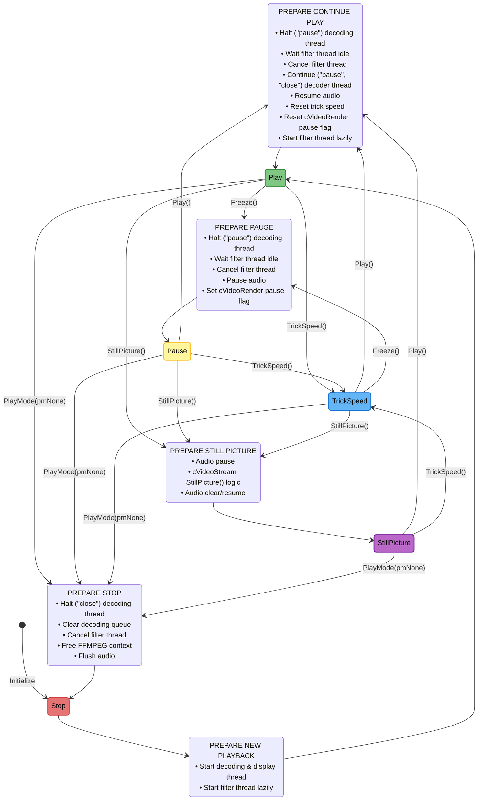
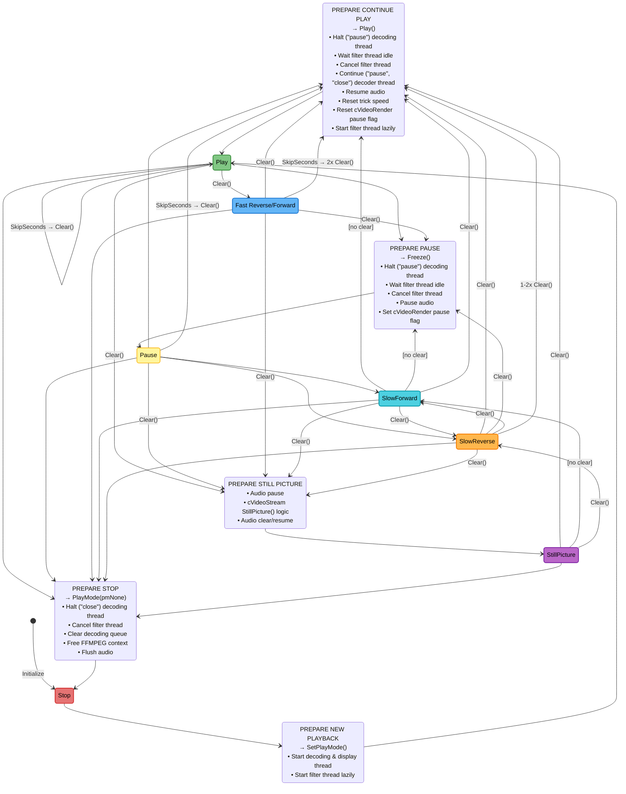
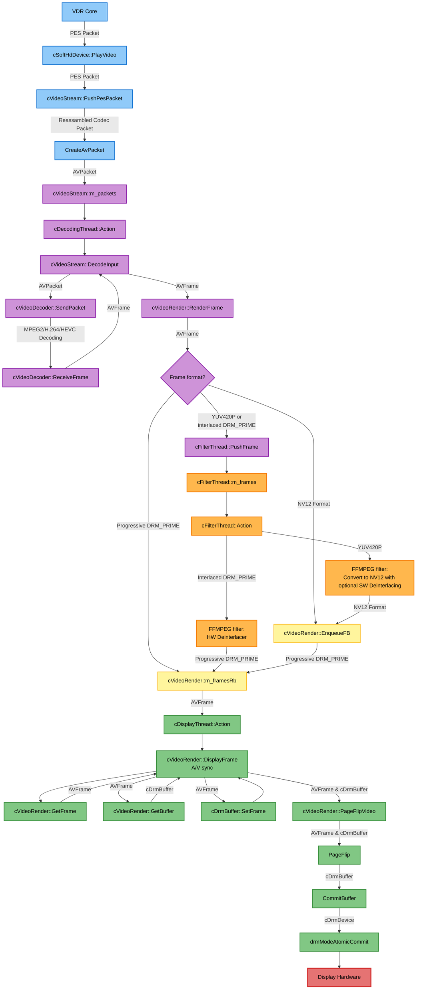

# Developer Documentation - softhddevice-drm-gles

This document contains technical documentation for developers, including the playback state machine and video data flow.

## State Diagram

### Simple Version

### Fat Version

## Video Data Flow Call Graph

This section shows the complete data flow of video frames from VDR through the plugin to the display hardware.

## Overview

The video pipeline consists of 4 main threads:

1. 🔵**VDR Thread** - Receives video data from VDR
2. 🟣**cDecodingThread** - Decodes video packets using FFmpeg
3. 🟠**cFilterThread** - Applies filters (deinterlacing, scaling)
4. 🟢**cDisplayThread** - Syncs with audio and commits frames to DRM/KMS

- 🔴 Hardware (DRM/KMS display hardware)
- 🟡 Buffers (frame buffers and queues)

## Detailed Call Graph

